# 📚 RWBY Bot - Catalogo Completo Comandi e Flow Diagram

## 📋 CATALOGO COMANDI

---

### 👤 Comandi Utente (Tutti)

| Comando | Descrizione | Modulo |
|---------|-------------|--------|
| `/start` | Messaggio di benvenuto | Core |
| `/help` | Mostra comandi disponibili (varia per ruolo) | Core |
| `/myflux` | Visualizza Flux personale e Tier | user-reputation |
| `/tier` | 🏛️ **Menu Sistema Tier** - Dettagli completi di ogni rango | user-reputation |
| `/voteban` | Avvia votazione per bannare (rispondi a un messaggio) | vote-ban |

---

### ⚙️ Comandi Admin Gruppo

#### 📊 Pannello Principale
| Comando | Descrizione | Modulo |
|---------|-------------|--------|
| `/settings` | 🎛️ **PANNELLO DI CONTROLLO PRINCIPALE** - Menu unificato per tutte le configurazioni | settings-menu |

#### 🛡️ Protezione Anti-Spam
| Comando | Descrizione | Modulo |
|---------|-------------|--------|
| `/spamconfig` | Configura anti-spam (sensibilità, azioni su flood/ripetizioni) | anti-spam |
| `/editconfig` | Configura anti-edit abuse (blocca inserimento link post-edit) | anti-edit-abuse |

#### 🤖 Moderazione AI
| Comando | Descrizione | Modulo |
|---------|-------------|--------|
| `/aiconfig` | Configura AI moderation (LM Studio, categorie, soglie) | ai-moderation |

#### 📝 Filtri Contenuto
| Comando | Descrizione | Modulo |
|---------|-------------|--------|
| `/wordconfig` | Gestisci parole/frasi vietate (blacklist keyword) | keyword-monitor |
| `/langconfig` | Configura filtro lingua (lingue permesse IT/EN/etc) | language-monitor |
| `/linkconfig` | Gestisci whitelist/blacklist link e domini | link-monitor |
| `/modalconfig` | Configura pattern modali (spam template per lingua) | modal-patterns |

#### 🖼️ Filtri Media
| Comando | Descrizione | Modulo |
|---------|-------------|--------|
| `/nsfwconfig` | Configura filtro NSFW (foto/video/GIF) | nsfw-monitor |
| `/visualconfig` | Configura visual immune system (hash matching immagini) | visual-immune-system |
| `/visualban` | Aggiungi immagine a blacklist visiva (rispondi a foto) | visual-immune-system |
| `/visualsafe` | Aggiungi immagine a whitelist visiva (rispondi a foto) | visual-immune-system |

#### 🔍 Profilazione
| Comando | Descrizione | Modulo |
|---------|-------------|--------|
| `/profilerconfig` | Configura profiler nuovi utenti (Tier 0) | intelligent-profiler |

#### ⚖️ Community & Votazioni
| Comando | Descrizione | Modulo |
|---------|-------------|--------|
| `/voteconfig` | Configura vote ban (soglia voti, durata, tier minimo) | vote-ban |

#### 📋 Logging & Staff
| Comando | Descrizione | Modulo |
|---------|-------------|--------|
| `/logconfig` | Configura sistema logging (eventi, formato, canale) | admin-logger |
| `/setlogchannel` | Imposta canale corrente come destinazione log | admin-logger |
| `/setstaff` | Imposta gruppo corrente come Staff Group (crea topic se forum) | staff-coordination |
| `/gnote` | Aggiungi nota globale su utente (`/gnote @user severity text`) | staff-coordination |
| `/notes` | Visualizza note su un utente (rispondi o menziona) | staff-coordination |

#### 🌐 Intel Network
| Comando | Descrizione | Modulo |
|---------|-------------|--------|
| `/intel` | Status Intel Network (tier gruppo, trust score, contributi) | intel-network |
| `/greport` | Segnala utente al network globale (richiede Tier 1+) | intel-network |

---

### 👑 Comandi SuperAdmin

> ⚠️ Riservati agli ID definiti in `SUPER_ADMIN_IDS` nel file `.env`

| Comando | Descrizione | Modulo |
|---------|-------------|--------|
| `/gpanel` | Dashboard governance globale (ban, bills, statistiche rete) | super-admin |
| `/setgstaff` | Configura gruppo Parliament (crea topic: Bans, Bills, Logs, Join Logs, Add Group, Image Spam, Link Checks) | super-admin |
| `/setglog` | Imposta canale log globale | super-admin |
| `/gwhitelist` | Gestisci whitelist domini globale (`list`/`add`/`remove`) | super-admin |
| `/gblacklist` | Gestisci blacklist domini globale (`list`/`add`/`remove`) | super-admin |
| `/gscam` | Gestisci pattern scam globali (`list`/`add`/`addregex`/`remove`) | super-admin |
| `/gmodal` | Gestisci modal patterns globali (`list`/`add`/`addpattern`/`remove`/`toggle`/`setaction`/`view`) | super-admin |

---

## 🔄 FLOW DIAGRAM - Elaborazione Messaggi

### 📝 Messaggio Testuale

```mermaid
flowchart TD
    subgraph INIT["🚀 INIZIALIZZAZIONE"]
        A[/"📨 Messaggio Ricevuto"/] --> B["💾 Cache User Info"]
        B --> C["📊 Calcola Flux/Tier"]
    end

    subgraph FILTERS["🛡️ FILTRI SEQUENZIALI"]
        C --> D{"🔐 È Admin?"}
        D -->|Sì| PASS["✅ PASSATO"]
        D -->|No| E{"🎖️ Tier ≥ 2?"}
        E -->|Sì| F["Skip maggior parte filtri"]
        E -->|No| G["🧹 Anti-Spam Check"]
        
        G --> H{"Flood/Burst?"}
        H -->|Sì| ACTION1["⚡ Azione: Delete/Ban/Report"]
        H -->|No| I["📝 Keyword Monitor"]
        
        I --> J{"Parola vietata?"}
        J -->|Sì| ACTION2["⚡ Azione: Delete/Ban/Report"]
        J -->|No| K["🌐 Language Monitor"]
        
        K --> L{"Lingua permessa?"}
        L -->|No| ACTION3["⚡ Azione: Delete/Ban/Report"]
        L -->|Sì| M["📋 Modal Patterns"]
        
        M --> N{"Match pattern?"}
        N -->|Sì| ACTION4["⚡ Azione: Delete/Ban/Report"]
        N -->|No| O["🔗 Link Monitor"]
        
        O --> P{"Link blacklist?"}
        P -->|Sì| ACTION5["⚡ Azione: Delete/Ban/Report"]
        P -->|No| Q["🤖 AI Moderation"]
        
        Q --> R{"AI: Scam/Hate?"}
        R -->|Sì| ACTION6["⚡ Azione: Delete/Ban/Report"]
        R -->|No| S["🔍 Intelligent Profiler"]
        
        S --> T{"Tier 0 sospetto?"}
        T -->|Sì| ACTION7["⚡ Azione: Delete/Ban/Report"]
        T -->|No| PASS
    end

    subgraph ACTIONS["⚡ SISTEMA AZIONI"]
        ACTION1 & ACTION2 & ACTION3 & ACTION4 & ACTION5 & ACTION6 & ACTION7 --> ACT{"Tipo Azione?"}
        ACT -->|delete| DEL["🗑️ Elimina silenzioso"]
        ACT -->|ban| BAN["🔨 Ban + Forward Parliament"]
        ACT -->|report_only| REP["📥 Invia a Staff Review"]
        
        BAN --> PARLIAMENT["🏛️ SuperAdmin può:\n• Global Ban\n• Blacklist Link\n• Blacklist Pattern"]
    end

    F --> PASS
```

---

### 🖼️ Immagine/Foto

```mermaid
flowchart TD
    A[/"📷 Foto Ricevuta"/] --> B["💾 Cache User + Tier"]
    
    B --> C{"🔐 È Admin?"}
    C -->|Sì| PASS["✅ PASSATO"]
    C -->|No| D{"🎖️ Tier ≥ 3?"}
    
    D -->|Sì| PASS
    D -->|No| E["🧬 Visual Immune System"]
    
    E --> F["📥 Download Immagine"]
    F --> G["🔢 Calcola pHash"]
    G --> H{"Match in DB?"}
    
    H -->|Sì, type=ban| ACTION1["⚡ Azione: Delete/Ban/Report"]
    H -->|Sì, type=safe| PASS
    H -->|No| I["🔞 NSFW Monitor"]
    
    I --> J["🤖 Invia a Vision LLM"]
    J --> K{"NSFW Detected?"}
    
    K -->|Sì, confidence ≥ threshold| ACTION2["⚡ Azione: Delete/Ban/Report"]
    K -->|No| PASS

    ACTION1 & ACTION2 --> ACT{"Tipo Azione?"}
    ACT -->|delete| DEL["🗑️ Elimina"]
    ACT -->|ban| BAN["🔨 Ban + Parliament"]
    ACT -->|report| REP["📥 Staff Review"]
```

---

### 🎬 Video

```mermaid
flowchart TD
    A[/"🎬 Video Ricevuto"/] --> B["💾 Cache User + Tier"]
    
    B --> C{"🔐 È Admin?"}
    C -->|Sì| PASS["✅ PASSATO"]
    C -->|No| D{"Tier ≥ 3?"}
    
    D -->|Sì| PASS
    D -->|No| E{"NSFW Videos enabled?"}
    
    E -->|No| PASS
    E -->|Sì| F["📥 Download Video"]
    
    F --> G["🎞️ Estrai Frame\n(ogni 5% durata)"]
    G --> H["🔁 Per ogni frame"]
    
    H --> I["🤖 Vision LLM Analysis"]
    I --> J{"NSFW in frame?"}
    
    J -->|Sì| ACTION["⚡ Azione + Stop\n(indica timestamp)"]
    J -->|No| K{"Altri frame?"}
    
    K -->|Sì| H
    K -->|No| PASS

    ACTION --> ACT{"Tipo Azione?"}
    ACT -->|delete| DEL["🗑️ Elimina"]
    ACT -->|ban| BAN["🔨 Ban + Parliament"]
    ACT -->|report| REP["📥 Staff Review"]
```

---

### 🎭 Sticker

```mermaid
flowchart TD
    A[/"🎭 Sticker Ricevuto"/] --> B["💾 Cache User + Tier"]
    
    B --> C{"🔐 È Admin?"}
    C -->|Sì| PASS["✅ PASSATO"]
    C -->|No| D{"Tier ≥ 3?"}
    
    D -->|Sì| PASS
    D -->|No| E["🧬 Visual Immune System"]
    
    E --> F["📥 Download Sticker"]
    F --> G["🔢 Calcola pHash"]
    G --> H{"Match in DB?"}
    
    H -->|Sì, type=ban| ACTION["⚡ Azione: Delete/Ban/Report"]
    H -->|No| PASS

    ACTION --> ACT{"Tipo Azione?"}
    ACT -->|delete| DEL["🗑️ Elimina"]
    ACT -->|ban| BAN["🔨 Ban + Parliament"]
    ACT -->|report| REP["📥 Staff Review"]
```

---

### 🎞️ GIF/Animation

```mermaid
flowchart TD
    A[/"🎞️ GIF Ricevuta"/] --> B["💾 Cache User + Tier"]
    
    B --> C{"🔐 È Admin?"}
    C -->|Sì| PASS["✅ PASSATO"]
    C -->|No| D{"Tier ≥ 3?"}
    
    D -->|Sì| PASS
    D -->|No| E{"NSFW GIFs enabled?"}
    
    E -->|No| PASS
    E -->|Sì| F["📥 Download GIF"]
    
    F --> G["🎞️ Estrai Frame Chiave"]
    G --> H["🤖 Vision LLM Analysis"]
    
    H --> I{"NSFW Detected?"}
    I -->|Sì| ACTION["⚡ Azione: Delete/Ban/Report"]
    I -->|No| PASS

    ACTION --> ACT{"Tipo Azione?"}
    ACT -->|delete| DEL["🗑️ Elimina"]
    ACT -->|ban| BAN["🔨 Ban + Parliament"]
    ACT -->|report| REP["📥 Staff Review"]
```

---

### ✏️ Messaggio Modificato

```mermaid
flowchart TD
    A[/"✏️ Edit Ricevuto"/] --> B["📸 Recupera Snapshot Originale"]
    
    B --> C{"🔐 È Admin?"}
    C -->|Sì| PASS["✅ PASSATO"]
    C -->|No| D{"Tier 0 + Lock attivo?"}
    
    D -->|Sì| DEL1["🗑️ Elimina (no modifica per novizi)"]
    D -->|No| E{"Link Injection?\n(prima no link, ora sì)"}
    
    E -->|Sì| ACTION1["🚨 CRITICO: Azione Injection"]
    E -->|No| F["📊 Calcola Similarità"]
    
    F --> G{"Similarità < soglia?"}
    G -->|Sì| ACTION2["⚠️ Cambio drastico sospetto"]
    G -->|No| PASS

    ACTION1 & ACTION2 --> ACT{"Tipo Azione?"}
    ACT -->|delete| DEL2["🗑️ Elimina"]
    ACT -->|ban| BAN["🔨 Ban + Before/After a Parliament"]
    ACT -->|report| REP["📥 Staff Review con diff"]
```

---

## 📊 Riepilogo Moduli

| Modulo | Tipo Contenuto | Trigger |
|--------|----------------|---------|
| anti-spam | Testo | Volume/Ripetizione messaggi |
| ai-moderation | Testo | Analisi semantica LLM |
| anti-edit-abuse | Testo (edit) | Modifica messaggio |
| intelligent-profiler | Tutto | Solo utenti Tier 0 |
| keyword-monitor | Testo | Parole/regex blacklist |
| language-monitor | Testo | Lingua non permessa |
| link-monitor | Testo | URL/Domini |
| modal-patterns | Testo | Template spam per lingua |
| nsfw-monitor | Foto/Video/GIF | Contenuto esplicito |
| visual-immune-system | Foto/Sticker | Hash matching |
| vote-ban | Comando | Votazione community |

---

## 🏛️ Sistema Tier

| Tier | Nome | Emoji | Flux | Descrizione |
|------|------|-------|-----------|-------------|
| 0 | **Tier 0** | 🌑 | 0 - 99 | Massimo scrutinio - Nuovi utenti |
| 1 | **Tier 1** | ⚔️ | 100 - 299 | Fiducia iniziale - Utenti confermati |
| 2 | **Tier 2** | 🛡️ | 300 - 499 | Pilastro community - Utenti stabili |
| 3 | **Tier 3** | 👁️ | 500+ | Quasi infallibile - Veterani |

### Bypass Details per Tier

#### 🌑 Tier 0
- ❌ **No bypasses** - All checks active
- Links/Forwards auto-deleted
- Cannot edit messages
- Maximum AI scrutiny

#### ⚔️ Tier 1 
- ✅ Profiler bypassed
- ✅ Language Monitor bypassed
- ✅ Can edit messages
- ✅ Forwards allowed

#### 🛡️ Tier 2
- ✅ Anti-Spam bypassed
- ✅ Keyword Monitor bypassed
- ✅ Link Monitor bypassed
- ✅ Modal Patterns bypassed
- ✅ Anti-Edit Abuse bypassed

#### 👁️ Tier 3
- ✅ **Almost everything bypassed**
- ✅ NSFW Monitor bypassed
- ✅ Visual Immune System bypassed
- ⚠️ Only AI for critical threats (SCAM, THREAT)
