# Flusso Completo dei Messaggi nel Bot Rwby

Questo documento descrive cosa succede **step-by-step** quando viene inviato un messaggio nel bot Telegram, con tutte le variazioni per i diversi tipi di contenuto.

---

## Panoramica Architettura

```mermaid
flowchart TB
    subgraph TELEGRAM["📱 Telegram Update"]
        MSG[Nuovo Messaggio/Media]
    end
    
    subgraph GLOBAL["🌐 Global Middleware"]
        UC[User Cache]
        I18N[i18n Middleware]
        AOC[Admin-Only Callbacks]
    end
    
    subgraph CORE["⚙️ Core Modules"]
        REP[User Reputation<br/>Calcolo Tier]
        CAS[CAS Ban Check]
    end
    
    subgraph DETECTION_TEXT["📝 Text Detection"]
        SPAM[Anti-Spam]
        KW[Keyword Monitor]
        LANG[Language Monitor]
        MODAL[Modal Patterns]
        LINK[Link Monitor]
        AI[AI Moderation]
    end
    
    subgraph DETECTION_MEDIA["🖼️ Media Detection"]
        NSFW[NSFW Monitor]
        VIS[Visual Immune System<br/>⚠️ DISABLED]
    end
    
    subgraph SPECIAL["🔧 Special Handlers"]
        EDIT[Anti-Edit Abuse]
        PROF[Intelligent Profiler<br/>Solo Tier 0]
    end
    
    MSG --> UC --> I18N --> AOC --> REP --> CAS
    CAS -->|User OK| SPAM --> KW --> LANG --> MODAL --> LINK --> AI
    CAS -->|CAS Banned| BAN[🚫 Ban + Stop]
    AI --> EDIT --> PROF --> NSFW --> VIS
    
    SPAM -->|Spam Detected| ACTION1[⚡ Action]
    KW -->|Keyword Match| ACTION2[⚡ Action]
    LANG -->|Wrong Language| ACTION3[⚡ Action]
    MODAL -->|Pattern Match| ACTION4[⚡ Action]
    LINK -->|Blacklist| ACTION5[⚡ Action]
    NSFW -->|NSFW Detected| ACTION6[⚡ Action]
```

---

## 1. 📱 Ricezione Update Telegram

Quando arriva un update da Telegram, grammY lo riceve e inizia a processarlo attraverso la catena di middleware.

---

## 2. 🌐 Global Middleware Chain

### Step 2.1: User Cache & Logging
**File**: [index.js](file:///Users/ripvampiretto/Documents/GitHub/Rwby/index.js#L44-L55)

```javascript
bot.use(async (ctx, next) => {
    // Cache user info nel database
    if (ctx.from) {
        db.upsertUser(ctx.from);
    }
    // Log messaggio
    const user = ctx.from?.first_name || 'System';
    const text = ctx.message?.text?.substring(0, 50) || 'Non-text update';
    logger.info(`[${user}] ${text}`);
    await next();
});
```

### Step 2.2: i18n Middleware
**File**: [index.js](file:///Users/ripvampiretto/Documents/GitHub/Rwby/index.js#L58)

Carica le traduzioni appropriate per la lingua dell'utente.

### Step 2.3: Admin-Only Callbacks
**File**: [menu-ownership.js](file:///Users/ripvampiretto/Documents/GitHub/Rwby/src/middlewares/menu-ownership.js)

Garantisce che solo gli admin possano interagire con le inline keyboard dei menu di configurazione.

---

## 3. ⚙️ Core Modules

### Step 3.1: User Reputation (OGNI messaggio)
**File**: [user-reputation/commands.js](file:///Users/ripvampiretto/Documents/GitHub/Rwby/src/features/user-reputation/commands.js#L6-L27)

```mermaid
flowchart TD
    A[Messaggio Ricevuto] --> B{Chat privata?}
    B -->|Sì| NEXT[➡️ next]
    B -->|No| C[Calcola ctx.userTier]
    C --> D[Calcola ctx.userFlux]
    D --> E{Ha un message?}
    E -->|No| NEXT
    E -->|Sì| F{Ultimo messaggio > 6 min fa?}
    F -->|No| NEXT
    F -->|Sì| G[+1 Flux per attività]
    G --> NEXT
```

**Cosa fa**:
1. Calcola e attacca `ctx.userTier` (0-4)
2. Calcola e attacca `ctx.userFlux` (punteggio locale)
3. Se è passato > 6 minuti dall'ultima attività, dà +1 Flux

### Step 3.2: CAS Ban Check
**File**: [cas-ban/index.js](file:///Users/ripvampiretto/Documents/GitHub/Rwby/src/features/cas-ban/index.js#L28-L40)

```mermaid
flowchart TD
    A[Messaggio] --> B{Chat privata?}
    B -->|Sì| NEXT[➡️ next]
    B -->|No| C{User in CAS banlist?}
    C -->|No| NEXT
    C -->|Sì| D[🚫 Ban utente]
    D --> E[📢 Notifica admin]
    E --> STOP[⛔ STOP Processing]
```

**Cosa fa**:
- Verifica se l'utente è nella lista ban di Combot Anti-Spam
- Se bannato: banna l'utente e FERMA tutto il processing

---

## 4. 📝 Text Detection Modules

Questi moduli processano solo messaggi con `message:text`.

### Step 4.1: Anti-Spam
**File**: [anti-spam/commands.js](file:///Users/ripvampiretto/Documents/GitHub/Rwby/src/features/anti-spam/commands.js#L9-L61)

```mermaid
flowchart TD
    A["message:text"] --> B{Chat privata?}
    B -->|Sì| NEXT[➡️ next]
    B -->|No| C{userTier >= 2?}
    C -->|Sì| NEXT
    C -->|No| D{spam_enabled?}
    D -->|No| NEXT
    D -->|Sì| E{È admin?}
    E -->|Sì| NEXT
    E -->|No| F[Aggiorna stats utente]
    F --> G[Incrementa contatori]
    G --> H{Stesso messaggio?}
    H -->|Sì| I[++duplicate_count]
    H -->|No| J[duplicate_count = 0]
    I --> K{Supera limiti?}
    J --> K
    K -->|No| NEXT
    K -->|Sì| L{Tipo violazione?}
    L -->|Volume| M[Azione volume]
    L -->|Repetition| N[Azione repetition]
    M --> STOP[⛔ STOP]
    N --> STOP
```

**Controlli**:
- **Volume**: Troppi messaggi in 10s o 60s
- **Repetition**: Stesso messaggio ripetuto

**Azioni possibili**: `delete`, `ban`, `report_only`

### Step 4.2: Keyword Monitor
**File**: [keyword-monitor/commands.js](file:///Users/ripvampiretto/Documents/GitHub/Rwby/src/features/keyword-monitor/commands.js#L9-L37)

```mermaid
flowchart TD
    A["message:text"] --> B{Chat privata?}
    B -->|Sì in wizard| W[Handle Wizard]
    B -->|Sì normale| NEXT[➡️ next]
    B -->|No| C{È admin?}
    C -->|Sì| NEXT
    C -->|No| D{userTier >= 2?}
    D -->|Sì| NEXT
    D -->|No| E[Scan parole vietate]
    E --> F{Match trovato?}
    F -->|No| NEXT
    F -->|Sì| G[Esegui azione configurata]
    G --> STOP[⛔ STOP]
```

**Cosa fa**:
- Cerca parole/regex nella lista word_filters
- Supporta match esatto o regex
- Ogni regola ha la sua azione specifica

### Step 4.3: Language Monitor
**File**: [language-monitor/commands.js](file:///Users/ripvampiretto/Documents/GitHub/Rwby/src/features/language-monitor/commands.js#L8-L62)

```mermaid
flowchart TD
    A["message:text"] --> B{Chat privata?}
    B -->|Sì| NEXT[➡️ next]
    B -->|No| C{Detection ready?}
    C -->|No| W[Wait for ready]
    W --> C
    C -->|Sì| D{È admin?}
    D -->|Sì| NEXT
    D -->|No| E{lang_enabled?}
    E -->|No| NEXT
    E -->|Sì| F{Tier >= bypass?}
    F -->|Sì| NEXT
    F -->|No| G{Testo >= min_chars?}
    G -->|No| NEXT
    G -->|Sì| H[Strip URLs e mentions]
    H --> I[Detect script non-Latin]
    I --> J{Script non permesso?}
    J -->|Sì| K[Esegui azione]
    J -->|No| L[Detect lingua con Franc]
    L --> M{Lingua non permessa?}
    M -->|No| NEXT
    M -->|Sì| K
    K --> STOP[⛔ STOP]
```

**Controlli**:
1. Script detection (cinese, arabo, cirillico, ecc.)
2. Language detection con franc

### Step 4.4: Modal Patterns
**File**: [modal-patterns/commands.js](file:///Users/ripvampiretto/Documents/GitHub/Rwby/src/features/modal-patterns/commands.js#L10-L31)

```mermaid
flowchart TD
    A["message:text"] --> B{Chat privata?}
    B -->|Sì| NEXT[➡️ next]
    B -->|No| C{È admin?}
    C -->|Sì| NEXT
    C -->|No| D{modal_enabled?}
    D -->|No| NEXT
    D -->|Sì| E{Tier >= bypass?}
    E -->|Sì| NEXT
    E -->|No| F[Check against modal patterns]
    F --> G{Pattern match?}
    G -->|No| NEXT
    G -->|Sì| H[Esegui azione + log]
    H --> NEXT
```

> **Nota**: A differenza degli altri, questo modulo **NON FERMA** il processing, continua con `next()`.

### Step 4.5: Link Monitor
**File**: [link-monitor/commands.js](file:///Users/ripvampiretto/Documents/GitHub/Rwby/src/features/link-monitor/commands.js#L8-L35)

```mermaid
flowchart TD
    A["message:text"] --> B{Chat privata?}
    B -->|Sì| NEXT[➡️ next]
    B -->|No| C{È admin?}
    C -->|Sì| NEXT
    C -->|No| D{link_enabled?}
    D -->|No| NEXT
    D -->|Sì| E{Tier >= bypass?}
    E -->|Sì| NEXT
    E -->|No| F[Scan URLs nel messaggio]
    F --> G{Trovato link?}
    G -->|No| NEXT
    G -->|Sì| H{Tipo link?}
    H -->|Whitelist| NEXT
    H -->|Blacklist| I[Delete + Report]
    H -->|Unknown| J[Report only]
    I --> STOP[⛔ STOP]
    J --> NEXT
```

### Step 4.6: AI Moderation
**File**: [ai-moderation/commands.js](file:///Users/ripvampiretto/Documents/GitHub/Rwby/src/features/ai-moderation/commands.js)

> **Nota**: Questo modulo NON ha un listener `message:text` automatico. Funziona solo via comando `/testai` o quando chiamato da altri moduli.

---

## 5. 🔧 Special Handlers

### Step 5.1: Anti-Edit Abuse (edited_message + message:text snapshot)
**File**: [anti-edit-abuse/commands.js](file:///Users/ripvampiretto/Documents/GitHub/Rwby/src/features/anti-edit-abuse/commands.js)

**Su `message:text`**:
```mermaid
flowchart TD
    A["message:text"] --> B{Chat gruppo?}
    B -->|No| NEXT[➡️ next]
    B -->|Sì| C[Salva snapshot messaggio]
    C --> NEXT
```

**Su `edited_message`**:
```mermaid
flowchart TD
    A["edited_message"] --> B{Chat privata?}
    B -->|Sì| NEXT[➡️ next]
    B -->|No| C{È admin?}
    C -->|Sì| NEXT
    C -->|No| D{edit_monitor_enabled?}
    D -->|No| NEXT
    D -->|Sì| E{Tier >= bypass?}
    E -->|Sì| NEXT
    E -->|No| F[Confronta con snapshot]
    F --> G{Link injection?}
    G -->|Sì| H[Azione injection]
    G -->|No| I{Modifica sospetta?}
    I -->|No| NEXT
    I -->|Sì| J[Azione abuse]
    H --> NEXT
    J --> NEXT
```

### Step 5.2: Intelligent Profiler (Solo Tier 0)
**File**: [intelligent-profiler/commands.js](file:///Users/ripvampiretto/Documents/GitHub/Rwby/src/features/intelligent-profiler/commands.js#L8-L29)

```mermaid
flowchart TD
    A["message (ogni tipo)"] --> B{Chat privata?}
    B -->|Sì| NEXT[➡️ next]
    B -->|No| C{È admin?}
    C -->|Sì| NEXT
    C -->|No| D{profiler_enabled?}
    D -->|No| NEXT
    D -->|Sì| E{userTier >= 1?}
    E -->|Sì| NEXT
    E -->|No| F[Scan messaggio per pattern sospetti]
    F --> G{Violazione?}
    G -->|No| NEXT
    G -->|Sì| H[Esegui azione]
    H --> STOP[⛔ STOP]
```

**Controlli per Tier 0**:
- Link nel primo messaggio
- Forward message sospetti
- Pattern spam conosciuti

---

## 6. 🖼️ Media Detection Modules

### Step 6.1: NSFW Monitor (Photo, Video, GIF, Sticker)
**File**: [nsfw-monitor/commands.js](file:///Users/ripvampiretto/Documents/GitHub/Rwby/src/features/nsfw-monitor/commands.js#L8-L80)

```mermaid
flowchart TD
    A["photo/video/animation/document/sticker"] --> B{Chat privata?}
    B -->|Sì| NEXT[➡️ next]
    B -->|No| C{È admin?}
    C -->|Sì| NEXT
    C -->|No| D{nsfw_enabled?}
    D -->|No| NEXT
    D -->|Sì| E{Tier >= bypass?}
    E -->|Sì| NEXT
    E -->|No| F[Rileva tipo media]
    F --> G{Tipo?}
    
    G -->|Video| H{nsfw_check_videos?}
    G -->|GIF| I{nsfw_check_gifs?}
    G -->|Photo| J{nsfw_check_photos?}
    G -->|Sticker| K{nsfw_check_stickers?}
    G -->|Animated Sticker| NEXT
    
    H -->|No| NEXT
    I -->|No| NEXT
    J -->|No| NEXT
    K -->|No| NEXT
    
    H -->|Sì| L[📥 Download + Analisi LLM]
    I -->|Sì| L
    J -->|Sì| L
    K -->|Sì| L
    
    L --> M{NSFW rilevato?}
    M -->|No| NEXT
    M -->|Sì| N[Forward a Parliament]
    N --> O[Esegui azione]
    O --> NEXT
```

> **Importante**: L'analisi NSFW è **fire-and-forget** (non blocca il processing).

**Tipi di media gestiti**:
| Tipo | Evento Telegram | Controllo config |
|------|-----------------|------------------|
| 📸 Foto | `message:photo` | `nsfw_check_photos` |
| 🎬 Video | `message:video` o `message:document` (video/*) | `nsfw_check_videos` |
| 🎞️ GIF | `message:animation` o `message:document` (image/gif) | `nsfw_check_gifs` |
| 🎭 Sticker | `message:sticker` (solo statici) | `nsfw_check_stickers` |

### Step 6.2: Visual Immune System
**File**: [visual-immune-system/commands.js](file:///Users/ripvampiretto/Documents/GitHub/Rwby/src/features/visual-immune-system/commands.js)

> ⚠️ **ATTUALMENTE DISABILITATO**: Ritorna immediatamente `next()`.

Quando attivo, userebbe perceptual hashing per rilevare immagini simili a contenuti già bannati.

---

## 7. 📊 Flusso Completo per Tipo di Messaggio

### 7.1 Messaggio di Testo


### 7.2 Immagine (Photo)

```mermaid
sequenceDiagram
    participant T as Telegram
    participant UC as User Cache
    participant REP as User Reputation
    participant CAS as CAS Ban
    participant PROF as Profiler
    participant NSFW as NSFW Monitor
    participant LLM as Vision LLM
    
    T->>UC: 📥 message:photo
    UC->>REP: next()
    REP->>REP: Calc tier + flux
    REP->>CAS: next()
    CAS->>CAS: Check CAS list
    alt CAS Banned
        CAS->>T: 🚫 Ban + STOP
    else OK
        CAS->>PROF: next()
    end
    PROF->>PROF: If Tier 0, check patterns
    alt Violation
        PROF->>T: ⚡ Action + STOP
    else OK
        PROF->>NSFW: next()
    end
    NSFW->>NSFW: Check config enabled
    alt Enabled
        NSFW-->>LLM: 🔄 Async: Download + Analyze
        LLM-->>LLM: Process image
        LLM-->>NSFW: Result
        alt NSFW detected
            NSFW->>T: 📢 Forward to Parliament
            NSFW->>T: 🗑️ Delete + Action
        end
    end
    NSFW->>T: ✅ Processing complete
```

### 7.3 Video

```mermaid
sequenceDiagram
    participant T as Telegram
    participant UC as User Cache
    participant REP as User Reputation
    participant CAS as CAS Ban
    participant PROF as Profiler
    participant NSFW as NSFW Monitor
    participant FF as ffprobe/ffmpeg
    participant LLM as Vision LLM
    
    T->>UC: 📥 message:video
    UC->>REP: next()
    REP->>CAS: next()
    CAS->>PROF: next()
    PROF->>NSFW: next()
    
    alt nsfw_check_videos enabled
        NSFW-->>T: 📥 Download video
        NSFW-->>FF: Extract frames
        FF-->>LLM: Analyze frames
        LLM-->>NSFW: Results
        alt NSFW detected
            NSFW->>T: 📢 Forward to Parliament
            NSFW->>T: 🗑️ Delete + Action
        end
    end
    NSFW->>T: ✅ Processing complete
```

### 7.4 GIF (Animation)

```mermaid
sequenceDiagram
    participant T as Telegram
    participant UC as User Cache
    participant REP as User Reputation
    participant CAS as CAS Ban
    participant PROF as Profiler
    participant NSFW as NSFW Monitor
    participant LLM as Vision LLM
    
    T->>UC: 📥 message:animation
    UC->>REP: next()
    REP->>CAS: next()
    CAS->>PROF: next()
    PROF->>NSFW: next()
    
    alt nsfw_check_gifs enabled
        NSFW-->>T: 📥 Download GIF
        NSFW-->>LLM: Extract frames + Analyze
        LLM-->>NSFW: Results
        alt NSFW detected
            NSFW->>T: 📢 Forward + Delete
        end
    end
    NSFW->>T: ✅ Processing complete
```

### 7.5 Sticker

```mermaid
sequenceDiagram
    participant T as Telegram
    participant UC as User Cache
    participant REP as User Reputation
    participant CAS as CAS Ban
    participant PROF as Profiler
    participant NSFW as NSFW Monitor
    participant LLM as Vision LLM
    
    T->>UC: 📥 message:sticker
    UC->>REP: next()
    REP->>CAS: next()
    CAS->>PROF: next()
    PROF->>NSFW: next()
    
    alt Animated sticker (Lottie)
        NSFW->>T: ⏭️ Skip (non analizzabile)
    else Static sticker
        alt nsfw_check_stickers enabled
            NSFW-->>T: 📥 Download sticker
            NSFW-->>LLM: Analyze image
            LLM-->>NSFW: Result
            alt NSFW detected
                NSFW->>T: 📢 Forward + Delete
            end
        end
    end
    NSFW->>T: ✅ Processing complete
```

### 7.6 Messaggio Modificato (Edit)

```mermaid
sequenceDiagram
    participant T as Telegram
    participant EDIT as Anti-Edit Abuse
    participant SNAP as Snapshots
    
    T->>EDIT: 📥 edited_message
    EDIT->>EDIT: Check config + admin + tier
    alt Should check
        EDIT->>SNAP: Get original snapshot
        SNAP->>EDIT: Original content
        EDIT->>EDIT: Compare with new content
        alt Link injection detected
            EDIT->>T: 🚨 Action: injection
        else Suspicious change
            EDIT->>T: ⚠️ Action: abuse
        end
    end
    EDIT->>T: ✅ Processing complete
```

---

## 8. 📋 Tabella Riepilogativa Moduli

| Modulo | Evento | Tier Bypass | Può fermare? | Note |
|--------|--------|-------------|--------------|------|
| User Cache | tutti | - | No | Salva info utente |
| User Reputation | tutti | - | No | Calcola tier |
| CAS Ban | `message` | - | **Sì** | Check lista ban globale |
| Anti-Spam | `message:text` | ≥2 | **Sì** | Volume/ripetizione |
| Keyword Monitor | `message:text` | ≥2 | **Sì** | Parole vietate |
| Language Monitor | `message:text` | config | **Sì** | Lingua sbagliata |
| Modal Patterns | `message:text` | config | No | Pattern spam |
| Link Monitor | `message:text` | config | **Sì** (blacklist) | URL detection |
| Anti-Edit Abuse | `message:text` + `edited_message` | config | No | Monitor modifiche |
| Intelligent Profiler | `message` | Solo Tier 0 | **Sì** | Nuovi utenti |
| NSFW Monitor | `photo/video/animation/sticker` | config | No (async) | Analisi LLM |
| Visual Immune | `photo/sticker` | config | No | ⚠️ DISABLED |

---

## 9. ⚡ Azioni Possibili

Ogni modulo può eseguire una di queste azioni:

| Azione | Cosa fa |
|--------|---------|
| `delete` | Elimina il messaggio |
| `ban` | Elimina messaggio + banna utente |
| `report_only` | Solo notifica agli admin |

---

## 10. 🛡️ Sistema di Bypass

### Tier System
```
Tier 0 (Ombra)      → 0-99 Flux    → Tutti i controlli attivi
Tier 1 (Scudiero)   → 100-299 Flux → Alcune esenzioni (profiler, edit, lang)
Tier 2 (Guardiano)  → 300-499 Flux → Bypass anti-spam, keyword, link, modal
Tier 3 (Sentinella) → 500+ Flux    → Bypass quasi tutti i controlli
```

### Chi è sempre esente
- **Admin** del gruppo: bypass tutti i controlli
- **Tier alto**: bypass configurabile per modulo
- **Chat private**: la maggior parte dei moduli ignora le chat private
